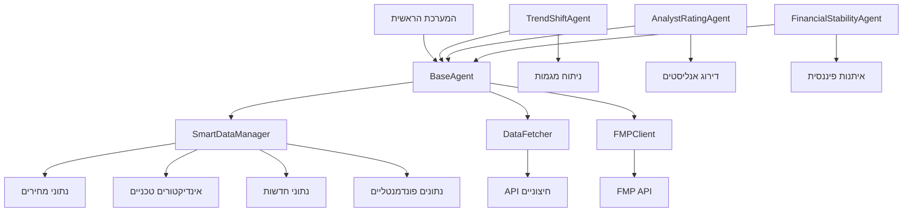

# דוגמה: אחידות מקורות נתונים בין סוכנים

## לפני השיפור - חוסר אחידות

### 1. TrendShiftAgent (לפני)
```python
# core/trend_shift_agent.py
from utils.data_fetcher import data_fetcher

class TrendShiftAgent:
    def __init__(self, config=None):
        self.config = config or {}
        # אין גישה אחידה לנתונים
    
    def analyze(self, symbol: str, price_df=None):
        # שליפה ישירה מ-API
        price_df = data_fetcher.fetch_prices(symbol, "1day")
        # ...
```

### 2. AnalystRatingAgent (לפני)
```python
# core/analyst_rating_agent.py
from utils.fmp_utils import fetch_analyst_estimates

class AnalystRatingAgent:
    def __init__(self, config=None):
        self.config = config or {}
        # אין גישה אחידה לנתונים
    
    def analyze(self, symbol, price_df=None):
        # שליפה ישירה מ-API
        data = fetch_analyst_estimates(symbol)
        # ...
```

### 3. FinancialStabilityAgent (לפני)
```python
# core/financial_stability_agent.py
from utils import data_fetcher

class FinancialStabilityAgent:
    def __init__(self, config=None):
        # אין גישה אחידה לנתונים
    
    def analyze(self, symbol, price_df=None):
        # שליפה ישירה מ-API
        balance = data_fetcher.get_balance_sheet(symbol)
        # ...
```

## אחרי השיפור - אחידות מלאה

### 1. BaseAgent עם מנהל נתונים חכם
```python
# core/base/base_agent.py
from utils.smart_data_manager import SmartDataManager

class BaseAgent(ABC):
    def __init__(self, config=None):
        super().__init__(config)
        self._init_data_managers()
    
    def _init_data_managers(self):
        """אתחול מנהלי הנתונים - עם טיפול בשגיאות"""
        try:
            self.data_manager = SmartDataManager()
            self.data_fetcher = DataFetcher()
            self.fmp_client = fmp_client
        except Exception as e:
            self.logger.warning(f"שגיאה באתחול מנהלי נתונים: {e}")
            self.data_manager = None
    
    def get_stock_data(self, symbol: str, days: int = None) -> Optional[pd.DataFrame]:
        """קבלת נתוני מניה דרך מנהל הנתונים החכם"""
        if not self.data_manager:
            return None
        return self.data_manager.get_stock_data(symbol, days)
    
    def get_fundamentals(self, symbol: str, statement_type: str = 'income') -> Optional[pd.DataFrame]:
        """קבלת נתונים פונדמנטליים"""
        if not self.data_manager:
            return None
        return self.data_manager.get_fundamentals(symbol, statement_type)
```

### 2. TrendShiftAgent (אחרי)
```python
# core/trend_shift_agent.py
from core.base.base_agent import BaseAgent

class TrendShiftAgent(BaseAgent):
    def __init__(self, config=None):
        super().__init__(config)  # יורש גישה לנתונים
    
    def analyze(self, symbol: str, price_df=None):
        # שימוש בגישה אחידה לנתונים
        if price_df is None:
            price_df = self.get_stock_data(symbol, days=180)
        # ...
```

### 3. AnalystRatingAgent (אחרי)
```python
# core/analyst_rating_agent.py
from core.base.base_agent import BaseAgent

class AnalystRatingAgent(BaseAgent):
    def __init__(self, config=None):
        super().__init__(config)  # יורש גישה לנתונים
    
    def analyze(self, symbol, price_df=None):
        # שימוש בגישה אחידה לנתונים
        if not self.fmp_client:
            return self.fallback()
        data = self.fmp_client.get_analyst_estimates(symbol)
        # ...
```

### 4. FinancialStabilityAgent (אחרי)
```python
# core/financial_stability_agent.py
from core.base.base_agent import BaseAgent

class FinancialStabilityAgent(BaseAgent):
    def __init__(self, config=None):
        super().__init__(config)  # יורש גישה לנתונים
    
    def analyze(self, symbol, price_df=None):
        # שימוש בגישה אחידה לנתונים
        balance = self.get_fundamentals(symbol, "balance")
        # ...
```

## תרשים זרימה - אחידות נתונים



## יתרונות השיפור

### 1. אחידות
- כל הסוכנים משתמשים באותו ממשק לנתונים
- אין צורך לזכור שמות פונקציות שונות
- טיפול אחיד בשגיאות

### 2. אמינות
- SmartDataManager מספק fallback אוטומטי
- אחסון מקומי עם עדכון אוטומטי
- ולידציה של נתונים

### 3. ביצועים
- Cache חכם לנתונים
- שליפה מקבילה של נתונים מרובים
- אופטימיזציה של אחסון

### 4. תחזוקה
- שינוי מקור נתונים אחד משפיע על כל המערכת
- קל להוסיף מקורות נתונים חדשים
- ניהול מרכזי של API keys

## דוגמה להרצה

```python
# main.py
from core.agent_loader import AgentLoader

# טעינת סוכנים
loader = AgentLoader("config/agent_config.yaml")
loader.load_all_agents()

# הרצת ניתוח - כל הסוכנים משתמשים באותו מקור נתונים
symbol = "AAPL"
result = loader.run_agent('trend_shift_agent', symbol)
print(f"ניתוח מגמה: {result}")

result = loader.run_agent('analyst_rating_agent', symbol)
print(f"דירוג אנליסטים: {result}")

result = loader.run_agent('financial_stability_agent', symbol)
print(f"איתנות פיננסית: {result}")
```

## סיכום

השיפור באחידות מקורות הנתונים מבטיח:
- **עקביות**: כל הסוכנים מקבלים נתונים באותו אופן
- **אמינות**: טיפול בשגיאות ומקורות גיבוי
- **יעילות**: שימוש ב-cache ואופטימיזציה
- **תחזוקה**: ניהול מרכזי של מקורות נתונים 

## דוגמת קוד אחידה (כל הסוכנים)

```python
class ExampleAgent(BaseAgent):
    def analyze(self, symbol, price_df=None):
        if price_df is None:
            price_df = self.get_stock_data(symbol, days=90)
            if price_df is None or price_df.empty:
                return self.fallback()
        # ... ניתוח ...
```

## תרשים זרימה

כל agent → BaseAgent → SmartDataManager → DataFetcher/APIs 